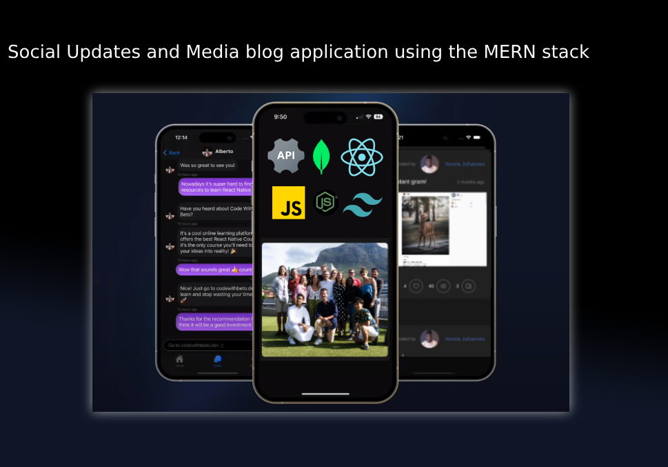

# My Social Blog/Hub - Fullstack

### Frontend: Built with the Vite App Router, & Tailwind
### Backend: Built with the Nodejs, Express, MongoDB, Mongoose



## Demo

You can check out a live demo of the application [here](https://mysite-kappa-neon.vercel.app).

## Key Features

- create, update and delete blog categories!
- create, update and delete post categories!
- create, update and delete stories/videos categories!
- upload images and videos

## Features

- 🛠️ Complete social website built from scratch in React/Vite
- 💻 Beautiful UI
- 🎨 Custom artwork included
- 💳 Full admin dashboard
- 🔑 Authentication
- 🌟 Clean, modern UI using Tailwind
- 🎁 ...much more

## Getting started

To get started with this project, run

```~~bash~~
  git clone https://github.com/Yonela-Johannes/my-social-hub
```

### Start the app

```shell
npm run dev
```

## Available commands

Running commands with npm `npm run [command]`

| command         | description                              |
| :-------------- | :--------------------------------------- |
| `dev`           | Starts a development instance of the app |

## License

[MIT](https://choosealicense.com/licenses/mit/)
